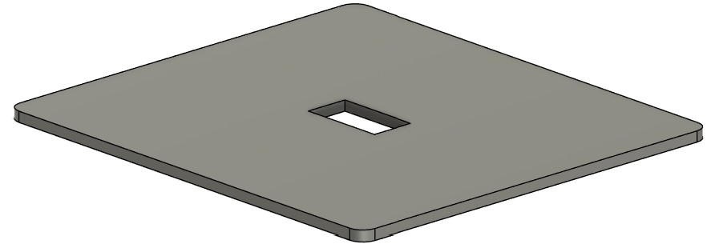

# JuniorDesign_FinalProject

## Design Overview

### The Inspiration

A field of robotics that has been exploding the past few years is humanoids with semi-AGI (Artificial General Intelligence) capabilities. These humanoids are complex and have the ability to not only perceive the world around themselves, but also accomplish some form of low-level cognitive behavior as a result of LLMs (Large Language Models) and other complex ML (Machine Learning) Algorithms that allow them to learn certain tasks on a high level and then replicate these tasks with finer detail (folding laundry, cooking, cleaning, moving parts in a warehouse, etc). While I don’t have enough time or skill (yet) to build one of these complex systems in the timeframe remaining of this course, I do believe I can work on one component; a "perceptive" head. For my Junior Design Final Project, I worked on creating a Robotic Head assistant using Agentic Behavior.

### The original HLD (High Level Design)

When I first ambitiously started this project, I wanted to use 2 cameras for eyes, 2 microphones for ears, and a speaker for the mouth. The head itself was then supposed to be attached to a base via a rotating servo that would allow it to move left and right depending on where it wants to look. The head was then meant to perceive its surroundings by detecting objects and people in its FOV and answering questions about those entities using Computer Vision + an Agent Network, simulating Agentic Behavior, another growing field in AI (Artificial Intelligence).


### The Final HLD

As the complexity of this project dawned on me, multiple simplifications had to be made in order to reduce the scope of the project to fit within the given timeframe. Instead of integrating all of the sensory inputs and outputs into a single head enclosure, controlled by a raspberry pi, I elected to use my laptop as the computational hub with built in speakers and microphone arrays, and connect the cameras directly to the Laptop. Furthermore, the servo was now controlled by a little Arduino Nano communicating with my laptop via a Serial connection. As we are not currently using Robotic arms or appendages, we cannot take full advantage of the stereo vision provided by the Depth Cameras, so the biggest change is falling back to monocular vision (although there are still plans to utilize the stereo features of the camera). 


This Robotic Head assistant will consist of 2 cameras for eyes, 2 microphones for ears, and 1 speaker for a mouth. The head will be attached to a motorized base allowing it to move left and right depending if it wants to follow or look for an object. The Head would be able to detect objects and answer questions about said objects or people using Computer Vision in tandem with Agentic Behavior, another growing field in AI (Artificial Intelligence).

### The Agent Network & Preliminary Design Verifications and Implementations

Agentic Behavior essentially creates specific roles or personas for an LLM. These roles could be anything from cooks to researchers and they are meant to use specific Prompt Engineering in order to confine an LLM to a particular knowledge base or skill where they are the sole experts. These Agents can then tackle different roles and communicate with each other in a team-like fashion. An example of how this is used for this project would be a classifier agent that takes a detection from the cameras and provides in-depth information on the entity. Another example could be a chat agent that keeps track of people in frame and handles all the conversation logic. Potentially, you could have a controls Agent that handles the decisions of whether or not the head should move left or right to track a person or object, or just look around the room to perceive its surroundings which would eventually be the goal.

#### Creating Our Agent Graph

The diagram below demonstrates our final set of Agents. their responsibilities, and how they flow and interact with each other.


We start with our scene or environment that consists of the user (and any other companions) and other various objects that may be in the scene. When the user prompts the system with their voice, it triggers the Cameras to also capture the current scene.

The audio is then passed into our Speech-to-Text **Prompt Agent** that is powered by Gemini while the Images are passed into our **Identifier / Classifier Agent** that is also powered by Gemini. Together, they append their outputs to the list of prompts that will be used by our actual **Chat Assistant Agent**. This agent takes our transcribed prompt, detected entities, and input images to then answer the prompt provided by the user with the added context of the scene.

The output of our Assistant Agent is then passed into our **Chat Voice Agent** that performs Text-to-Speech using OpenAI's models and the 'onyx' voice. This is the final output heard by the user.

In the future, in addition to the audio output, the BBOX detections from the Object Classifier can then be passed into another **Motion Agent** that identifies the relevant entity to focus on and translates the bounding box coordinates to commands for the servo to follow to focus on the user. Instead, for now, we use YuNet's Facial Detection model to generate the bounding box that is used to calculate the error from the center of the image and commands the servo to correct for this error as seen below.

```python
def calculate_servo_angle(self, bbox_center_x, image_center_x):
    error = bbox_center_x - image_center_x
    adjustment = 0.01 * error
    new_angle = self.current_angle - adjustment
    self.current_angle = max(0, min(180, new_angle))
    return self.current_angle

bbox_center_x = bboxes[0][0] + (bboxes[0][2] // 2)
image_center_x = color_image.shape[1] / 2
new_angle = face_tracker.calculate_servo_angle(bbox_center_x, image_center_x)

# Check that we have a valid angle
if 0 <= new_angle <= 180:
    face_tracker.write_to_servo(new_angle)
```

Since we have a single axis for motion, this simplifies the calculation a bit so we only really need to account for the correction to the X coordinate while ignoring the Y coordinate. We adjust for the error by some Kp value which we have tuned to 0.01 for our case.

#### Developing our input methods (Speech-to-Text Prompt Agent)

There are a multitude of different ways we can approach input. We could use a textbox for inputting questions and prompts, but this takes some of the magic away of actually speaking with someone. That is why, I've elected to use Speech as our input. Using speech allows us to use more natural language to converse with the assistant which is what LLMs thrive on. Additionally, it opens up the door in the future to work with multiple languages as support is added to Gemini and OpenAI models, or to even train our own Speech-To-Text models for various multi-lingual chat scenarios. However, for now we will focus on using English to interact with the robot.

There presents a problem, however, of how we actually want to signify the start of the User prompting the assisstant. We could use speech recognition to determine key word phrases similar to "Hey Siri", "Hey Google", "Hey Alexa", but that does not facilitate back and forth conversations very well, and also adds significantly more computational complexity and overhead. Instead, I opted to simply signify asking the assistant something by pressing 'r' as a record button. Similar to someone paging their assistant in an actual office space. When 'r' is released, the recording stops and is saved locally. We can accomplish all of this quite fast using PyAudio library.

Test Output for Audio Prompt Collection:
```
Press 'r' to start recording & release to stop.
Recording Started...
Recording Stopped.

Audio Recording Complete.
```

The recorded audio prompt is then passed through a Transcription Agent whose sole purpose is to transcribe Audio messages into text. This agent utilizes the Gemini API in order to take an audio file as input (WAV file in our case) and outputs the transcription text as output saved into a "prompt" variable.

```
Audio saved to C:\Users\mucke\Pitt\Fall_2024\junior_design\JuniorDesign_FinalProject\prompt.wav
Transcribed Text Prompt: Write me a small poem about the Legend of Zelda.
```

#### Using [Gemini](https://ai.google.dev/gemini-api/docs/quickstart?_gl=1*17d54za*_up*MQ..&gclid=CjwKCAiAmfq6BhAsEiwAX1jsZ0pijycy7uQXAYtBiWm_CS0-SJHGn6CynoKkWXzQRwCfrn1JO_HbJRoCefsQAvD_BwE&lang=python) for Facial Recognition and Temporal Tracking (Object Classification Agent)

In the competitive space of AI and Large Language Models (LLMs), there are many different competitors fighting for marketshare. Some of the biggest names in the space at this moment are OpenAI's ChatGPT, Anthropic's Claude, Meta's Llama, and Google's Gemini. Of these models, I've elected to utilize Google's Gemini API with both the Flash (free and light weight) and Pro (paid, larger, more advanced) models from their Gemini 1.5 lineup. One of the primary benefits of Gemini is it's 2M token context window for Pro (1M for Flash) that allows for long-context conversational chats, something that this application should benefit from. As an AI desk assistant, we don't need to remember ALL of the chat history, but if we are tokenizing image frames for input into the model, we will want to keep track of users and the context of their surroundings and interactions. Long-Context should enable us to have longer chat sessions without losing memory because each image is scaled to fit within Gemini's resolution limits (minimum of 768 pixels, maximum of 3072) and capped at 258 tokens.

The Gemini API is very well documented and their flash and pro models are some of the only models to offer multi-modal capabilities that span a significant number of modalities (ie. text, images, videos, audio). My time at Google allowed me to learn more about the API and its limitations and use cases. By using the Gemini API, I don't need to worry about quanitizing any largescale models to fit within limited computational resources. By calling the API directly, I can leverage Google's datacenters and compute in order to process queries and produce tokens faster than I could locally on a laptop or raspberry pi.

However, there are still downsides to this approach. The first being data security, with this solution, image frames and query data are all likely shared with Google as we are using their APIs. Additionally, there is significantly more latency as we have to send the query to their servers and then wait for the tokens to be produced and sent back to our laptop, therefore this prevents our system from running at ultra low latency and polling frames quickly because of the network overhead. Although, this is still significantly faster than running any larger models locally as output tokens would not be produced nearly as quickly.

So we've discussed using Cascades and YuNet for Facial Detection, but what about actually identifying the person in frame? For that, we need some way to preserve termporal context if we aren't going to use tracking. We can accomplish this with Gemini through custom structure response outputs and preemptively loading the model with identities. For example, if I provide the model with the following images.

 

I can tell the model that this is Will. Theoretically, it should then be capable of detecting and knowing Will better as the conversation continues. Furthermore, this can extend to objects as well, where we can prompt Gemini about objects that are also within the frame.

For our given test case, we specify a structured type "Entity" as defined below.

```python
class Entity(typing.TypedDict):
    entity_name: str
    entity_type: str
    entity_location: list[int]
```

We can then specify the return type for the model with a configuration as such:

```python
# Set up Model API
genai.configure(api_key=gemini_api_key)
conf = genai.types.GenerationConfig(
    temperature=1.0,
    response_mime_type="application/json",
    response_schema=list[Entity]   
)
identifier_model = genai.GenerativeModel("models/gemini-1.5-flash", generation_config=conf)
```

Below is an example chat with Gemini providing the last 2 images as inputs with the following prompts. We first start with an initial prompt to tell Gemini the behavior we want for this particular "agent".

```python
# Start Interaction
chat = identifier_model.start_chat(history=[])
chat.send_message("""
    You are an identifier, your job is to identify people and objects within images.
    Provide answers that are concise and accurate, and do not hallucinate or make up any answers.
    
    For the entity name:
        if the entity is a person, fill with some random identifier ID unless provided with a specific name.
        if the entity is an object, fill with the name of the object (ie phone, pen, apple, etc).
                    Try to be specific as possible when identifying objects (iPhone vs. Phone, Red Shirt vs Shirt, Black Marker vs Pen)     
    For the entity location, use a list in [ymin, xmin, ymax, xmax] format.
    For the entity type, use 'person' for people, and 'item' for objects.
                    
    List all relevant entities (people and objects) within the frame that are relevant to the query.
""")
```

Here is the following chat after the agent has been primed:

```
________________________________________________________________________________
Prompt: input_image1 + input_image2 + "The person in this image is William."
Model Response:
 [{"entity_location": [186,486,500,637], "entity_name": "William", "entity_type": "person"}, {"entity_location": [0,0,0,0], "entity_name": "Over-ear Headphones", "entity_type": "item"}, {"entity_location": [0,0,0,0], "entity_name": "Red Nike T-Shirt", "entity_type": "item"}, {"entity_location": [0,0,0,0], "entity_name": "Eyeglasses", "entity_type": "item"}]
________________________________________________________________________________
Prompt: input_image3 + "Who is holding the phone?"
Model Response:
 [{"entity_location": [166,406,603,682], "entity_name": "William", "entity_type": "person"}, {"entity_location": [327,678,625,851], "entity_name": "iPhone 12 with MagSafe Case", "entity_type": "item"}]
________________________________________________________________________________
Prompt: "What type of phone is he holding"
Model Response:
 [{"entity_location": [327,678,625,851], "entity_name": "iPhone 12 with MagSafe Case", "entity_type": "item"}]
```

We can see with just the first prompt, the model was able to detect various objects that were on or around William (me) such as "Over-ear headphones", "Red Nike T-Shirt", and "Glasses".

By telling Gemini that we also want a bounding box for the answer of each entity, we can then perform a simple calculation to actually convert this bounding box to the coordinate frame of our original image. First we just divide each coordinate by 1000, and then we multiply the x coordinates by the width of the original image and we multiple the y coordinates by the height of the original image. Using these coordinates for the bounding box, we can draw a rectangle representing where Gemini thinks the object is as well as labeling it with the name Gemini thinks it is as seen below:


The detection and predictions are not perfect or consistent, but can likely be dialed in with tuning the temperature value for the model responses, but this is out of scope for the timeframe of this project.

#### Generating Outputs for the User (Chat Agent & Text-To-Speech Voice Agent)

The prompt generated from the transcribed audio recording is then passed into our Gemini Chat Assistant Agent which actually answers our questions based on the relevant context and any input images also provided from the Idetification / Classification Agent. This generates our final output.

```
Generating Gemini Response...
Response:
Hyrule's fields, a verdant sight,
Princess held, in shadows' might.
Links's sword, a shining gleam,
Against the darkness, a hero's dream.

Ganon's rage, a wicked fire,
Triforce sought, a dark desire.
Through dungeons deep, and trials dire,
Zelda's hope, a burning pyre.
```

Now, we create an additional Agent that handles Text-to-Speech. Our Agent uses OpenAI's text-to-speech models with the 'Onyx' voice to then read the generated output back out to the users through the speakers.

```
Converting Response to Speech with OpenAI model...
Playing Audio...
Audio playback complete.
Audio Finished.
```

While you cannot hear it in this README, Gemini's response was read out by ChatGPT's TTS1 model.

### Assisting the Model with Facial Detection

As you may have noticed earlier, we supplement the image inputs into the Chat Agent by using bounding boxes around detected facial features in the image. This helps prime the model to have better contextual awareness of the entities it's interacting with while also aiding in keeping track of those entities. While there are many ways to go about facial detection, there are two primary methods investigated for this project: Haar Cascades and YuNet Model.

#### Using OpenCV for Facial Detection

### [Haar Cascades](https://docs.opencv.org/3.4/db/d28/tutorial_cascade_classifier.html)

Object Detection using Haar feature-based cascade classifiers was an effective object detection method proposed by Paul Viola & Micahel Joones in their paper: ["Rapid Object Detection using a Boosted Cascade of Simple Features"](https://www.cs.cmu.edu/~efros/courses/LBMV07/Papers/viola-cvpr-01.pdf) in 2001.

This machine learning approach uses a cascade function trained from numerous images with and without faces. For the feature extraction, Haar features are used which can be seen below.


These kernels are used to compute the features of a given frame by summing the pixels under the white and black rectangles, but even for small frames (24x24), this generates an enormous amount of features (160,000). This was solved with the integral image where the calculation for each pixel was solved with only 4 pixels, making things faster.

As the model is trained, the features that are most accurate in classifying faces are weighed highly while the rest are not. The final classifier is a weighted sum of the weak classifiers that normally cannot classify an image on their own. Overall, the paper showed great results with using just 200 features (95% accuracy), but ended up with ~6000 features in the final setup.

However, there was still a huge inefficiency, for a given image, you apply all 6000 features to it. This is inefficient because most of the image is not going to have a face, so we waste a lot of compute searching over the entire image. Instead, we can check whether or not a window within the image is likely to be a face region, if it's not, discard it in a single shot and don't process it again.

This is where the **Cascade of Classifiers** comes into play, instead of applying all 6000 features on a window, the features are grouped into stages of classifiers that are applied one-by-one. If a window fails in the first stage, throw it out so we don't consider the remaining features. The paper used 6000+ features spread across 38 different stages (1, 10, 25, 25, and 50 in the first 5 stages).

Luckily, OpenCV provides methods for training your own Cascade Classifier model or using a pretrained model. For the purposes of this project, I investigated using a pretrained model. The results of which can be found below.


As we can see, the model has significant false positives and also fails to detect non-frontal faces. There are multiple reasons for this, the main one being that we are using the frontal face pretrained model. If we trained our own model with our own dataset, we could likely achieve better non-frontal detection performance, but that is out of the scope of this project.

#### [YuNet](https://link.springer.com/article/10.1007/s11633-023-1423-y)

This is where [YuNet](https://link.springer.com/article/10.1007/s11633-023-1423-y) comes in. The YuNet model came from Wei Wu, Hanyang Peng, and Shiqi Yu who recognized a need for fast and accurate Facial Detection models. They developed a lightweight facial detection model that was designed for mobile and embedded device applications that had limited compute resources, perfect for this project.

YuNet achieved a strong balance between accuracy and speed at the millisecond-level while significantly reducing the parameters (75,856) and computational costs, making it a fifth the size of other small face detectors.

The architecture uses depthwise separable convolution with Tiny Feature Pyramid Network for combining multiscale features. Their detection head is an anchor-free mechanism that simplifies predictions by reducing candidate locations, enabling faster inference and lower computation requirements. As a result, YuNet saw a mAP of 81.1% on the WIDER FACE validation hard track while maintaining a millisecond-level inference speed, outperforming other models in terms of speed and efficiency.

Luckily, OpenCV also has a pretrained YuNet model readily available for use, resulting in a much more accurate and stable result that works with minor occlusions and non-frontal facial positions as seen below!


## Using Fusion 360 for the Physical Design

### The Base

The base of the design is meant to house a Raspberry Pi alongside the actual servo that will be rotating the head. The Raspberry Pi sits within the enclosure with added holes for both ventilation and various I/O Ports (ie. HDMI, USB, power, etc) as can be seen in the images below.




This is what essentially acts as our base for the head to rest on while sitting atop someone's desk. However, it's important to note that for this project, there was not enough time to get everything working on the Raspberry Pi, so instead, the Base only houses the servo and an Ardino Nano that connects to the user's laptop for serial communications.

### The Head

The head has been designed to fit up to a RealSense d455 Depth Camera sensor. There is an extruded platform on which the sensor rests, with enough space to be able to actually plug in the camera from below still. Additionally, there is a hole exiting the back of the head for which the connecting cables can exit and plug into the Raspberry Pi housed in the base or a user's laptop (like in our V1 prototype).

Additional holes are placed in the front fascia where there is supposed to be an integrated speaker, but for now, the speaker was not added, so it serves to act as some additonal ventilation for the camera sensor.

Unfortunately, my CADing skills are still very poor, so the design of the head itself is very limited. However, it did result in a very cool Iron Man Prototype-esque appearance that looks awesome to some, and probably terrifying to most. This is my first time ever really designing anything in CAD, and it's definitely my first time ever 3D Printing anything, so there were many failed prints along the way.


### Issues with Printing

There were multiple issues experienced while 3D Printing the initial design. By far the worst issue was misalignment on key dimension measurements resulting in prints that were completely unusuable, wasting filament, time, and energy. The Initial Front Head piece actually could not fit the RealSense camera sensor. I attempted to file down the platform, but there was too much material to remove. Additionally, with how the STL file was oriented prior to print, there was a severe layer-shift that warped the print and weakened the base on which the camera was supposed to rest on. This was fixed in the following iteration, although there were still some minor adjustments needed post-printing due to the dimensions being off by a few millimeters. In the future, I think I will definitely be much more precise with my measurements and ensure that I allow for some level or degree of wiggle-room when it comes to fitting parts that are complex in shape or just integral to the system in general. The new version of the front fascia can be seen below. There are still adjustment that need to be made, but this was sufficient for a V1 Prototype demo.


## Testing

As we scaled up the system, there were many different components that needed to be tested as I was getting to understand the APIs. After creating my initial design plan, I began tackling each individual agent one-by-one to ensure that I understood the requirements of the model inputs and outputs. Looking into the *agent_ws* and *camera_ws* directories, you can find a multitude of Python scripts just experimenting and testing various features and agent setups.

There were a multitude of issues that came up, but debugging was not too bad. Most issues were either formatting or syntax errors which could be traced from the error traces. Adding in try-except blocks also helped a lot to raise exceptions when trying to use various APIs or libraries.

## What's Next?

Overall, I aimed to create an Agentic Robotic Head that could ask as my own personal desk buddy to entertain and interact with me whenever I want. While the design is not perfect, and there are many improvements that could be made in both hardware and software, this was an invaluable learning experience to help facilitate my curiosity and desires for exploration.

The first improvements to be made involvde the physical design. I want to completely redesign the Head in Fusion such that it more naturally fits the Realsense, has actual fixed screws for securing the head in place (so it doesn't look like it just wants to completely flop over), and reduce the overall size of the base so we aren't wasting resources. Additionally, I would like to explore actually integrating a microphone array and speaker system into the head to have an all-in-one enclosure. The peripherals should be controlled by the Pi while the actual puppeteering of the system would all be handled by the User's laptop.

Furthermore, I have little to no experience with actual UI design or Frontend Software development, so I would love to develop a webapp to host the whole service that neatly integrates the camera stream, model outputs, and system in general. Similar to any other LLM chat UI (chatgpt, claude, gemini), but with the physical integration of the head and base. Even more ideally, the information would all be communicated over bluetooth. This should be possible with minimal overhead since all of the model computations are still happening on external servers, we would just be modifying how the host laptop communicates with the Head in a local environment. Combining front-end development with additional features like "web-searching" capabilities would be absolutely incredible. 

Finally, it would be incredible to fine-tune and train my own models for the agents to maximize the actual response quality and performance. At the end of the day, I am proud of what I was able to accomplish in quite literally less than a month while also taking multiple other classes. Robots will forever be cool!


## References
- https://www.intelrealsense.com/sdk-2/
- https://github.com/IntelRealSense/librealsense/releases/tag/v2.56.3
- https://github.com/IntelRealSense/librealsense/blob/master/wrappers/python/examples/opencv_viewer_example.py
- https://www.youtube.com/watch?v=CmDO-w56qso&ab_channel=EngineeringCorner
- https://www.datacamp.com/tutorial/face-detection-python-opencv
- https://ai.google.dev/gemini-api/docs?gad_source=1&gclid=CjwKCAiAmfq6BhAsEiwAX1jsZ0pijycy7uQXAYtBiWm_CS0-SJHGn6CynoKkWXzQRwCfrn1JO_HbJRoCefsQAvD_BwE
- https://link.springer.com/article/10.1007/s11633-023-1423-y
- https://www.cs.cmu.edu/~efros/courses/LBMV07/Papers/viola-cvpr-01.pdf
- https://www.kaggle.com/code/junhyeonkwon/using-yunet
- https://discuss.ai.google.dev/t/how-to-make-a-conversation-with-gemini-that-supports-pictures/52472
- https://platform.openai.com/docs/api-reference/audio
- https://platform.openai.com/docs/guides/speech-to-text
- https://platform.openai.com/docs/quickstart?desktop-os=windows&language-preference=python
- https://www.youtube.com/watch?v=BMqRz3s36bY&ab_channel=ReallyEasyAI-TutorialsforEveryone
- https://github.com/ReallyEasyAI/Working-with-the-Audio-APIs/tree/main
- https://stackoverflow.com/questions/40704026/voice-recording-using-pyaudio
- https://www.instructables.com/Sweep-Servo-Motor-With-Arduino-Nano/
- https://www.quora.com/Is-it-possible-to-recognize-a-partial-face-occluded-or-non-frontal-face-by-training-Haar-Classifier
- https://ai.google.dev/gemini-api/docs/audio?_gl=1*yl59cb*_up*MQ..&gclid=CjwKCAiAmfq6BhAsEiwAX1jsZ0pijycy7uQXAYtBiWm_CS0-SJHGn6CynoKkWXzQRwCfrn1JO_HbJRoCefsQAvD_BwE&lang=python
- https://ai.google.dev/gemini-api/docs/long-context?_gl=1*1fngx5o*_up*MQ..&gclid=CjwKCAiAmfq6BhAsEiwAX1jsZ0pijycy7uQXAYtBiWm_CS0-SJHGn6CynoKkWXzQRwCfrn1JO_HbJRoCefsQAvD_BwE
- https://ai.google.dev/gemini-api/docs/structured-output?_gl=1*1fngx5o*_up*MQ..&gclid=CjwKCAiAmfq6BhAsEiwAX1jsZ0pijycy7uQXAYtBiWm_CS0-SJHGn6CynoKkWXzQRwCfrn1JO_HbJRoCefsQAvD_BwE&lang=python
- https://ai.google.dev/gemini-api/docs/vision?_gl=1*1eums12*_up*MQ..&gclid=CjwKCAiAmfq6BhAsEiwAX1jsZ0pijycy7uQXAYtBiWm_CS0-SJHGn6CynoKkWXzQRwCfrn1JO_HbJRoCefsQAvD_BwE&lang=python


