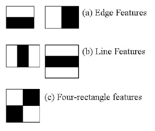

# JuniorDesign_FinalProject

## Using OpenCV for Facial Detection

### [Haar Cascades](https://docs.opencv.org/3.4/db/d28/tutorial_cascade_classifier.html)

Object Detection using Haar feature-based cascade classifiers was an effective object detection method proposed by Paul Viola & Micahel Joones in their paper: ["Rapid Object Detection using a Boosted Cascade of Simple Features"](https://www.cs.cmu.edu/~efros/courses/LBMV07/Papers/viola-cvpr-01.pdf) in 2001.

This machine learning approach uses a cascade function trained from numerous images with and without faces. For the feature extraction, Haar features are used which can be seen below.

These kernels are used to compute the features of a given frame by summing the pixels under the white and black rectangles, but even for small frames (24x24), this generates an enormous amount of features (160,000). This was solved with the integral image where the calculation for each pixel was solved with only 4 pixels, making things faster.

As the model is trained, the features that are most accurate in classifying faces are weighed highly while the rest are not. The final classifier is a weighted sum of the weak classifiers that normally cannot classify an image on their own. Overall, the paper showed great results with using just 200 features (95% accuracy), but ended up with ~6000 features in the final setup.

However, there was still a huge inefficiency, for a given image, you apply all 6000 features to it. This is inefficient because most of the image is not going to have a face, so we waste a lot of compute searching over the entire image. Instead, we can check whether or not a window within the image is likely to be a face region, if it's not, discard it in a single shot and don't process it again.

This is where the **Cascade of Classifiers** comes into play, instead of applying all 6000 features on a window, the features are grouped into stages of classifiers that are applied one-by-one. If a window fails in the first stage, throw it out so we don't consider the remaining features. The paper used 6000+ features spread across 38 different stages (1, 10, 25, 25, and 50 in the first 5 stages).

Luckily, OpenCV provides methods for training your own Cascade Classifier model or using a pretrained model. For the purposes of this project, I investigated using a pretrained model. The results of which can be found below.

As we can see, the model has significant false positives and also fails to detect non-frontal faces. There are multiple reasons for this, the main one being that we are using the frontal face pretrained model. If we trained our own model with our own dataset, we could likely achieve better non-frontal detection performance, but that is out of the scope of this project.

### [YuNet](https://link.springer.com/article/10.1007/s11633-023-1423-y)

This is where [YuNet](https://link.springer.com/article/10.1007/s11633-023-1423-y) comes in. The YuNet model came from Wei Wu, Hanyang Peng, and Shiqi Yu who recognized a need for fast and accurate Facial Detection models. They developed a lightweight facial detection model that was designed for mobile and embedded device applications that had limited compute resources, perfect for this project.

YuNet achieved a strong balance between accuracy and speed at the millisecond-level while significantly reducing the parameters (75,856) and computational costs, making it a fifth the size of other small face detectors.

The architecture uses depthwise separable convolution with Tiny Feature Pyramid Network for combining multiscale features. Their detection head is an anchor-free mechanism that simplifies predictions by reducing candidate locations, enabling faster inference and lower computation requirements. As a result, YuNet saw a mAP of 81.1% on the WIDER FACE validation hard track while maintaining a millisecond-level inference speed, outperforming other models in terms of speed and efficiency.

Luckily, OpenCV also has a pretrained YuNet model readily available for use, resulting in a much more accurate and stable result that works with minor occlusions and non-frontal facial positions as seen below!

## Using Gemini for Facial Recognition and Temporal Tracking

FILL IN.

## References
- https://www.intelrealsense.com/sdk-2/
- https://github.com/IntelRealSense/librealsense/releases/tag/v2.56.3
- https://github.com/IntelRealSense/librealsense/blob/master/wrappers/python/examples/opencv_viewer_example.py
- https://www.youtube.com/watch?v=CmDO-w56qso&ab_channel=EngineeringCorner
- https://www.datacamp.com/tutorial/face-detection-python-opencv
- https://ai.google.dev/gemini-api/docs?gad_source=1&gclid=CjwKCAiAmfq6BhAsEiwAX1jsZ0pijycy7uQXAYtBiWm_CS0-SJHGn6CynoKkWXzQRwCfrn1JO_HbJRoCefsQAvD_BwE
- https://link.springer.com/article/10.1007/s11633-023-1423-y
- https://www.cs.cmu.edu/~efros/courses/LBMV07/Papers/viola-cvpr-01.pdf
- 
